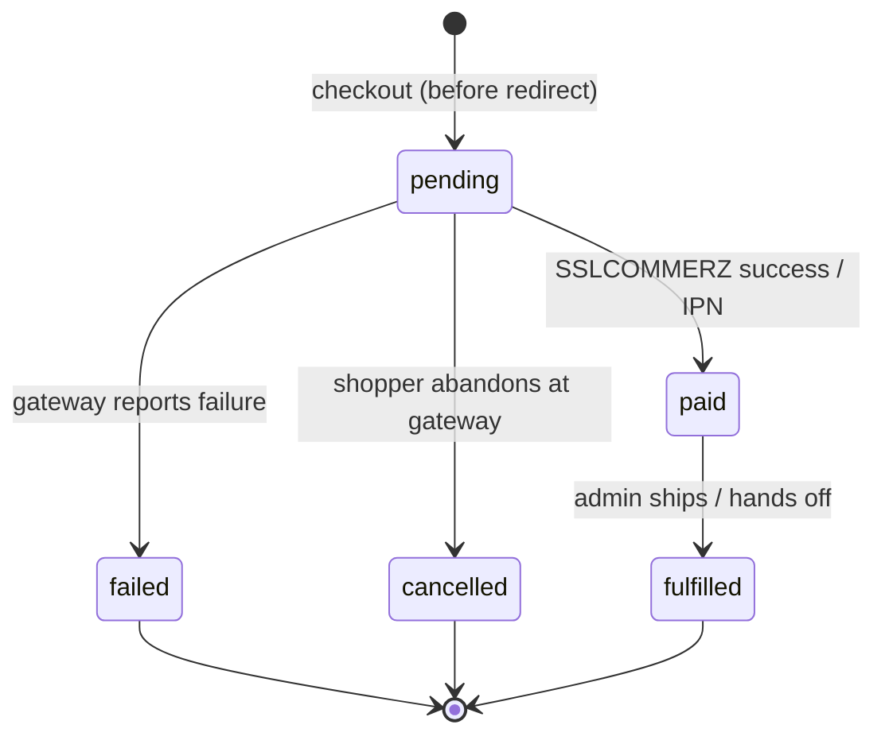

# Order state machine: explicit legal transitions, idempotency at the gateway seam

The `Order` lifecycle is modelled as an explicit state machine. A pure module
(`app/order_state.py`) declares the legal transitions and **raises**
`IllegalTransition` on any move outside them; re-applying the current status is an
idempotent no-op. Gateway callbacks keep a separate `if not pending` guard that
absorbs duplicate/stale deliveries.

Legal transitions:

| From       | To                          | Driver         |
| ---------- | --------------------------- | -------------- |
| `pending`  | `paid`, `failed`, `cancelled` | gateway        |
| `paid`     | `fulfilled`                 | admin          |
| terminal (`failed` / `cancelled` / `fulfilled`) | — | —    |

This is the spine of v2: the idempotent IPN handler and the per-size atomic
decrement both hang off the `pending → paid` transition.

## Why

- **Legality and idempotency are different concerns and live in different places.**
  Legality ("can a `cancelled` order become `paid`?") is a domain rule — it should
  fail loudly, because hitting it means a bug or a bad admin action. Idempotency
  ("the IPN fired twice", "a `fail` callback arrived after we already marked `paid`")
  is a network reality — it must be a silent no-op, because raising would 500 back
  to the gateway and make it retry forever.
- So the **pure state machine raises** (`IllegalTransition` → surfaced as HTTP 409
  on the admin endpoint), and the **gateway handlers keep their `if order.status
  != pending` guard** as the place that tolerates duplicate/stale callbacks. That
  guard is the exact seam the v2 idempotent-IPN work will deepen into exactly-once
  handling (dedup on the gateway transaction id, row locking) — this ADR does not
  build that, it just names the seam.
- **`fulfilled` is admin-driven, not gateway-driven.** `paid` means *payment
  cleared*; `fulfilled` means *shipped*. Conflating them would lose the shop
  owner's ability to track what still needs to go out the door.
- **No DB migration.** Status stays a plain string (ADR-0002: enums-as-strings to
  avoid `ALTER TYPE` pain); `fulfilled` is just a new allowed value.

## Alternatives considered

- **Tolerant core (swallow everything as a no-op).** Rejected: it hides genuine
  bugs — an admin fulfilling a `pending` order, or code attempting an impossible
  move, would pass silently. The whole value of a state machine is catching those.
- **Strict core with callers catching `IllegalTransition` for duplicates.**
  Rejected: it conflates "expected duplicate callback" with "programmer error" at
  the catch site. The explicit `if not pending` guard reads as intent and keeps the
  idempotency seam visible for the v2 work.

## Scope

- **In:** the legal-transition map, `IllegalTransition`, the `fulfilled` state, an
  admin `PATCH /admin/orders/{order_number}` that drives `paid → fulfilled` (illegal
  → 409). Extends ADR-0006 (orders snapshot + status lifecycle).
- **Out:** exactly-once IPN handling and the concurrency-safe decrement (v2, separate
  issues); refunds / reversing a `paid` order (v3+); the admin "mark fulfilled" UI
  button (a frontend slice).
